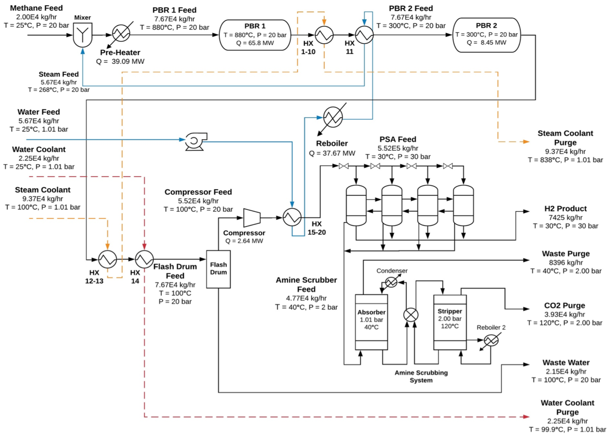

# Sustainable Hydrogen Production by Steam-Methane Reforming: Plant Design and Economic Analysis
 
_Authors: Robert Davison, Aaron Veronese, Jaehun Chung_

---

## Executive Summary

In light of growing uncertainty over climate change, the need for economically viable ways to generate electricity without emitting CO2 grows more pressing every day. This report seeks to evaluate the economic potential of hydrogen gas as a CO2 free, sustainable fuel source for hydrogen fuel cell electric vehicles (HFCEVs). We propose a novel design for a chemical plant capable of producing 63 kilotons annually (KTA) of hydrogen gas, with a composition of 0.99999 wt % H2 at a pressure of 30 bar, to be sold for $1,300 per metric ton (MT).

High purity hydrogen gas is traditionally made using a steam-methane reformer (SMR) followed by a water gas shift (WGS) reactor. Our design incorporates these reactions, but it is unique because all CO2 produced is isolated and sequestered using an amine scrubbing system in order to eliminate all greenhouse gas emissions. 

The first two reactions are performed in two packed bed reactors (PBRs) that are placed in series. According to the reaction kinetics and various economic evaluations, the optimal reaction conditions were determined to be 880 °C and 20 bar for the SMR, and 300 °C and 20 bar for the WGS. These conditions maximize profit while still producing the specified amount of hydrogen gas. 

Optimal heat integration can be achieved by purchasing pure water at STP for `$0.05` per MT and pumping it through a network of 20 heat exchangers in order to heat it up before finally mixing it with the natural gas feed. The natural gas feed is purchased for $132 per MT and is composed of 98 wt% CH4 and 2 wt% CO2. The gas mixture is heated in a furnace and enters the first reactor at 880 °C and 20 bar. Natural gas is fed at a rate of 168 million (MM) kg per year, and water is fed at a rate of 476 MM kg per year corresponding to a feed molar ratio (MR) of 2.5:1. 

Assuming a 2-year construction period, we estimate that a total capital investment (TCI) of `$70` million would be required and can be financed with a 10-year bond at a fixed rate of 4%. After 12 years of operation the plant is projected to have an NPV of $10.8 MM and an NPV% of 1.11%. 

The resultant economics are profitable, but do not fall in the acceptable range for a chemical plant. However, due to the environmental advantages of a CO2-neutral fuel source, it is likely that people would be willing to pay more in the future for fuel if it is clean. Further calculations found that if the sale price of the hydrogen product increases by 28.0% to $1,670 per MT, the proposed plant would yield a positive NPV% of 10.0% per year after 12 years of operation. Under these assumptions, this design appears promising and would merrit further investigation. 

---
[Full Written Report](https://github.com/robertcdavison/Sustainable_Hydrogen_Production_Plant/blob/master/Full-Report.pdf)
---

## Process Flow Diagram

**Figure 1.** Process flow diagram of the proposed plant where water and methane are converted to produce 63 kta of high purity hydrogen gas.

